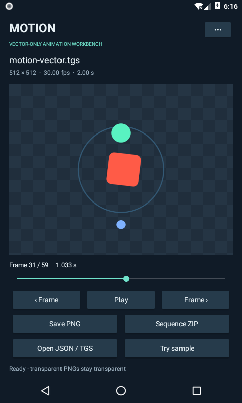

# Oritwig Motion

**Maintenance and safety:** Samsung’s [current rlottie README](https://github.com/Samsung/rlottie#readme) declares the project deprecated and no longer maintained, with no security support, vulnerability review, patches, releases or CVE coordination. This older historical-pin preview is for **self-authored test animations only**. Do not open unknown or untrusted files, or choose it as a default production dependency for a new project. The wrapper’s limits and functional checks do not replace upstream security maintenance.

[Lottie for Android](https://github.com/airbnb/lottie-android) is an existing alternative to evaluate for new Android work. It has not been integrated, benchmarked or validated as a migration here; no performance, quality or security superiority claim is made.

Historical reference preview: a small, account-free Android workbench for local vector animations. Open a Lottie JSON or gzipped TGS, play or scrub its original frames, inspect dimensions and timing, and save transparent PNGs. Export a selected range as a PNG-sequence ZIP with a timing manifest.

The rendering engine is Samsung **rlottie as historically shipped by Telegram Android**, pinned to `00a9454aeaa5970884e13abc4ec6c42a125742d0`. Oritwig supplies the JNI, bounded file handling and Android interface. The parser, keyframes, geometry and rasterizer are retained from that historical engine. No Telegram account, API key or server is required.



Actual Android 8.0 software-emulator capture, using the included synthetic vector fixture. [Watch the 32-second screenshot demo](docs/media/demo-compact.mp4) · [Capture identity and scope](docs/media/manifest.json).

## Compared with upstream

- **rlottie** is a renderer library, not a ready Android workbench. The pinned Telegram tree integrates animations into messaging and account-linked workflows
- **Oritwig Motion** adds local JSON/TGS inspection, frame stepping, transparent PNG and ranged sequence-ZIP export, plus a reusable account-free engine module. It needs no Telegram account, API key or server
- Compatibility is deliberately narrower: this is a bounded vector subset, with no animation authoring. It makes no performance or rendering-quality superiority claim over upstream

## Use

1. Open JSON / TGS through Android’s document picker, or try the included synthetic sample
2. Play, step or scrub; settings control looping, playback speed and preview/PNG size
3. Save one PNG, or choose a source-frame range and step for a sequence ZIP

Your last imported JSON, position and settings are stored privately on the device and restored on launch. There is no account, Internet permission, analytics or background service. The app pauses playback when leaving the screen. You can clear its saved copy from the menu.

## Build and reuse

Requires JDK 21, Android SDK/build-tools 35, NDK `27.2.12479018` and CMake `3.22.1`.

```sh
./gradlew :app:assembleDebug :app:assembleDebugAndroidTest :app:lintDebug :engine:testDebugUnitTest
```

Gradle 8.11.1, AGP 8.9.3 and dependency verification are pinned. Set `ANDROID_HOME` or `sdk.dir` in an untracked `local.properties`. Android 8.0+; packaged ABIs are arm64-v8a, x86 and x86_64. armeabi-v7a is not included.

`:engine` builds a reusable AAR. `AnimationInput.read` validates bounded JSON/TGS bytes; `MotionAnimation` exposes metadata and synchronous frame rendering, and `FrameExport` writes PNGs/sequences. Call these off the UI thread, serialize operations, recycle returned bitmaps and close animations. `librlottie.so` is separately linked from `liboritwig_motion_jni.so` using the shared C++ runtime.

## Boundaries

- Vector-only animations. Repeaters, polystar/polygon generators, dashed strokes, raster/external assets, text/fonts, expressions, audio and 3D are explicitly rejected
- Historical rlottie is not a promise of compatibility with every modern Lottie feature
- Input and decompressed JSON: 2 MiB each; source canvas: 4,096 px per side; timeline: 1,800 whole frames, 120 fps and 120 seconds; bounded nesting, 80,000 values, 128 layers/assets and 4,096 references; expanded precomposition scenes are capped at 4,096 instances / 80,000 value-work units
- PNGs: up to 1,024 px maximum side. ZIP: at most 120 frames, 512 px, 32 million total pixels and 64 MiB. Its manifest records source fps and selected frame indices; it is not a video or GIF
- Preview may skip frames on slow hardware. Export renders the requested frames. Cancellation is checked between native calls; it cannot interrupt a rasterization already in progress
- This is a native parser, not a security sandbox. Bounds reduce resource exposure; they do not establish a general hostile-file security guarantee

## Source and licenses

The combined distribution is under GPLv3. The historical LGPL grants were exercised through LGPL 2.1 §3; copyrights and additional third-party notices remain. See `LICENSE`, `NOTICE.txt` and `provenance/licenses` for the precise license choices, Abseil attribution and NDK/LLVM runtime notices.

Upstream runtime algorithm bodies are retained. The two unused `tgnet/FileLog.h` includes were removed; license-reference changes are separately recorded. Build configuration selects the upstream scalar implementation and disables no supported algorithm. See `provenance` for pinned URLs, Git blobs, byte hashes and reviewed diffs.

The complete buildable source is intended to accompany each binary. Rebuild the AAR/app or substitute a compatible rebuilt rlottie shared library and rebuild/sign your own APK. No signing key is required from this project, and there is no restriction on modification or reverse engineering for debugging those changes. See [rebuilding](docs/rebuild.md), [input policy](docs/INPUT-POLICY.md) and [validation and testing limits](docs/VALIDATION.md).
